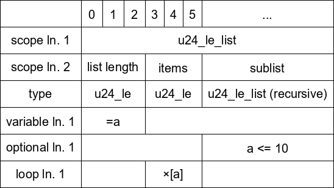

# binfmtspec
A package for defining and visualizing binary format specifications.

## Features
- format abstraction
- renaming of scope lines
- recursion detection (using the binary_spec_component decorator)
- repeating structures
- optional structures
- variables 

## Example
```python
from binfmtspec import BinarySpec, binary_spec_component

@binary_spec_component("u24_le")
def u24_le(s: BinarySpec):
    s.add_bytes(3) # write 3 bytes. since this is always at the last level of scopes this mus define how many bytes the structure is long

@binary_spec_component("u24_le_list")
def u24_le_list(s: BinarySpec):

    s.start_scope("list length") # start scope for list length

    repeat_count = s.start_var() # create a new variable section
    u24_le(s) # add the variable content
    s.end_var() # end the variable

    s.end_scope() # end the scope list length

    s.start_scope("items") # start scope "items"
    s.start_repeat(repeat_count) # start a repeating section for repeat_count times
    u24_le(s) # render each item as u24_le
    s.end_repeat() # end the repeating structure
    s.end_scope() # end the scope "items" 

    s.start_scope("sublist") # start scope "sublist" (
    s.start_conditional("{} <= 10".format(repeat_count)) # start a conditional section, with text description "repeat_count <= 10"
    u24_le_list(s) # render the u24_le_list structure (recursively)
    s.end_conditional() # end the conditional section
    s.end_scope() # end scope

s = BinarySpec()
u24_le_list(s) # render the u24_le_list structure

s.rename_level(2, "type") # renames "scope ln. 3" to "type"
s.render(20) # returns PIL image
```


